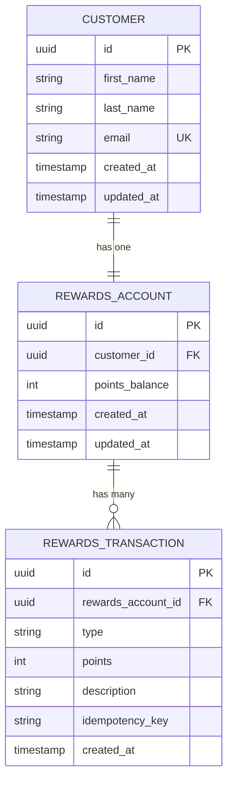
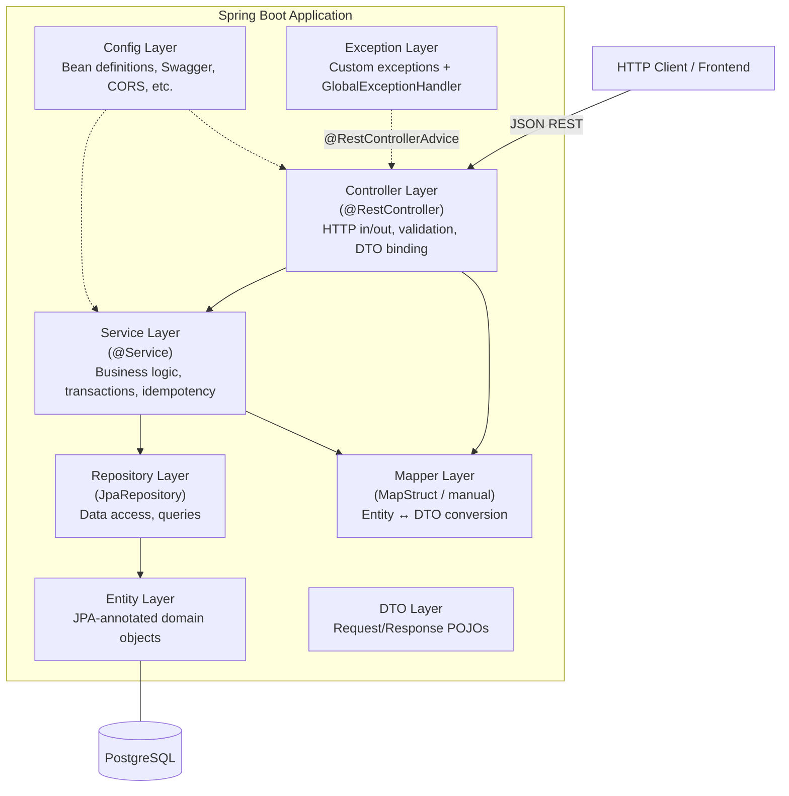
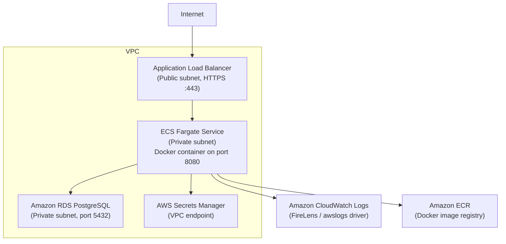

# Customer Rewards Platform — Requirements & Technical Design Specification

**Version:** 1.1  
**Status:** Draft — Pending Review  
**Project:** FDE Portfolio — Customer Rewards Platform  
**Date:** 2026-10-05

---

## Table of Contents

1. [Project Overview](#1-project-overview)
2. [Business Requirements](#2-business-requirements)
3. [Domain Model](#3-domain-model)
4. [Database Design](#4-database-design)
5. [API Design](#5-api-design)
6. [Idempotency Design](#6-idempotency-design)
7. [Architecture Design](#7-architecture-design)
8. [DTO Design](#8-dto-design)
9. [Error Handling Design](#9-error-handling-design)
10. [Security Considerations](#10-security-considerations)
11. [Observability Design](#11-observability-design)
12. [Configuration Design](#12-configuration-design)
13. [Testing Strategy](#13-testing-strategy)
14. [Implementation Plan](#14-implementation-plan)
15. [Future AWS Deployment Notes](#15-future-aws-deployment-notes)
16. [Future Amazon Bedrock Integration Notes](#16-future-amazon-bedrock-integration-notes)

---

## 1. Project Overview

### Purpose and Scope

The Customer Rewards Platform is a production-ready RESTful backend service that manages customer loyalty accounts and reward point transactions. It is built as a portfolio demonstration for a Forward Deployed Engineer role, showcasing expertise in Java/Spring Boot microservice design, clean layered architecture, transactional integrity, API design best practices, and production-grade engineering concerns (observability, secrets management, containerization).

The service is intentionally scoped as a standalone, single-service backend. It exposes a versioned REST API consumed by any future front-end or mobile application. Authentication and authorization are deferred to a future phase (see Section 10); the MVP focuses on correct domain logic, data integrity, and developer experience.

### Key Business Capabilities

| Capability | Description |
|---|---|
| Customer Registration | Create a named customer account with a unique email address |
| Customer Lookup | Retrieve current customer profile and metadata |
| Rewards Balance Enquiry | Return the customer's current point balance |
| Reward Redemption | Deduct points from a customer's balance with idempotency protection |
| Transaction History | Paginated, chronological log of all reward credit and debit events |

---

## 2. Business Requirements

**BR-01 — Create Customer Account**  
A caller must be able to create a new customer account by supplying a first name, last name, and unique email address. The system assigns a globally unique customer identifier (UUID) and provisions a rewards account with a zero balance. Duplicate email addresses must be rejected.

**BR-02 — Retrieve Customer Details**  
A caller must be able to retrieve a customer's profile (name, email, account creation date) by supplying the customer's UUID. An unknown customer ID must return a clear not-found error.

**BR-03 — Retrieve Rewards Balance**  
A caller must be able to retrieve the current rewards point balance for a given customer. The balance is always a non-negative integer (points, not currency).

**BR-04 — Redeem Reward Points**  
A caller must be able to submit a redemption request specifying the number of points to deduct from a customer's balance. The system must:
- Validate that the requested points are a positive integer.
- Reject the request if the customer's current balance is insufficient (i.e., would go negative).
- Process the deduction atomically (all-or-nothing).
- Protect against duplicate submissions: a second request carrying the same idempotency key must return the result of the original request without re-processing.

**BR-05 — View Reward Transaction History**  
A caller must be able to retrieve a paginated list of all reward transactions (both credits and debits) for a customer, ordered from most recent to oldest. Each transaction record includes: transaction ID, type (CREDIT / DEBIT), points, description, and timestamp.

---

## 3. Domain Model

### Entities

#### Customer

The root aggregate. Represents a registered person in the system.

| Field | Java Type | Constraints |
|---|---|---|
| `id` | `UUID` | PK, not null, immutable |
| `firstName` | `String` | Not null, max 100 chars |
| `lastName` | `String` | Not null, max 100 chars |
| `email` | `String` | Not null, unique, valid email format, max 255 chars |
| `createdAt` | `Instant` | Not null, set on insert, immutable |
| `updatedAt` | `Instant` | Not null, managed by JPA |

#### RewardsAccount

One-to-one with Customer. Holds the mutable balance. Protected against concurrent lost updates via JPA optimistic locking (`@Version`).

| Field | Java Type | Constraints |
|---|---|---|
| `id` | `UUID` | PK, not null, immutable |
| `customerId` | `UUID` | FK → Customer.id, unique, not null |
| `pointsBalance` | `int` | Not null, default 0, must be ≥ 0 (enforced in service + DB check constraint) |
| `version` | `long` | Not null, default 0; managed exclusively by JPA (`@Version`). Incremented on every UPDATE. |
| `createdAt` | `Instant` | Not null, set on insert |
| `updatedAt` | `Instant` | Not null, managed by JPA |

#### RewardsTransaction

Immutable ledger record. Each credit or debit is a separate row.

| Field | Java Type | Constraints |
|---|---|---|
| `id` | `UUID` | PK, not null, immutable |
| `rewardsAccountId` | `UUID` | FK → RewardsAccount.id, not null |
| `type` | `TransactionType` (enum) | Not null; values: `CREDIT`, `DEBIT` |
| `points` | `int` | Not null, positive integer (> 0) |
| `description` | `String` | Nullable, max 255 chars |
| `idempotencyKey` | `String` | Nullable, max 255 chars; unique within the account (partial unique index) |
| `createdAt` | `Instant` | Not null, set on insert, immutable |

### Entity Relationships



### Key Design Decisions

- **RewardsAccount is separate from Customer** — decouples profile concerns from financial ledger concerns and makes future account suspension / multi-account scenarios tractable without touching the Customer table.
- **RewardsTransaction is append-only** — the balance is stored denormalized on RewardsAccount for O(1) balance reads; the transaction table is the audit trail. Any discrepancy can be reconciled from the transaction log.
- **Idempotency key stored on the transaction** — keeps idempotency data co-located with the business event it guards; no separate idempotency table required for MVP.
- **`@Version` on RewardsAccount for optimistic locking** — prevents concurrent redemptions from racing against a stale balance read. See Section 6 for the full concurrency design and why both `@Version` and the idempotency unique constraint are required together.

---

## 4. Database Design

### Table: `customers`

| Column | Type | Nullable | Constraints |
|---|---|---|---|
| `id` | `UUID` | NOT NULL | PRIMARY KEY |
| `first_name` | `VARCHAR(100)` | NOT NULL | |
| `last_name` | `VARCHAR(100)` | NOT NULL | |
| `email` | `VARCHAR(255)` | NOT NULL | UNIQUE |
| `created_at` | `TIMESTAMPTZ` | NOT NULL | DEFAULT now() |
| `updated_at` | `TIMESTAMPTZ` | NOT NULL | DEFAULT now() |

**Indexes:**
- `PK`: `id`
- `UQ`: `email`

---

### Table: `rewards_accounts`

| Column | Type | Nullable | Constraints |
|---|---|---|---|
| `id` | `UUID` | NOT NULL | PRIMARY KEY |
| `customer_id` | `UUID` | NOT NULL | UNIQUE, FK → `customers(id)` ON DELETE CASCADE |
| `points_balance` | `INT` | NOT NULL | DEFAULT 0, CHECK (`points_balance >= 0`) |
| `version` | `BIGINT` | NOT NULL | DEFAULT 0; incremented by JPA on every UPDATE (optimistic lock counter) |
| `created_at` | `TIMESTAMPTZ` | NOT NULL | DEFAULT now() |
| `updated_at` | `TIMESTAMPTZ` | NOT NULL | DEFAULT now() |

**Indexes:**
- `PK`: `id`
- `UQ`: `customer_id`

> **Note:** The `version` column must never be set or modified by application code. JPA's `@Version` mechanism owns it entirely. Any direct SQL UPDATE that bypasses JPA (e.g., a manual admin script) must increment `version` explicitly to avoid invalidating in-flight optimistic lock checks.

---

### Table: `rewards_transactions`

| Column | Type | Nullable | Constraints |
|---|---|---|---|
| `id` | `UUID` | NOT NULL | PRIMARY KEY |
| `rewards_account_id` | `UUID` | NOT NULL | FK → `rewards_accounts(id)` ON DELETE CASCADE |
| `type` | `VARCHAR(10)` | NOT NULL | CHECK (`type` IN (`'CREDIT'`, `'DEBIT'`)) |
| `points` | `INT` | NOT NULL | CHECK (`points > 0`) |
| `description` | `VARCHAR(255)` | NULL | |
| `idempotency_key` | `VARCHAR(255)` | NULL | |
| `created_at` | `TIMESTAMPTZ` | NOT NULL | DEFAULT now() |

**Indexes:**
- `PK`: `id`
- `IX`: `rewards_account_id` (for history queries)
- `UQ` (partial): `(rewards_account_id, idempotency_key)` WHERE `idempotency_key IS NOT NULL`
  - This prevents two transactions for the same account sharing an idempotency key, while allowing NULL keys for non-idempotency-protected operations (e.g., administrative credits).

---

### Flyway Migration Strategy

All schema changes are managed exclusively through Flyway versioned migration scripts. The convention is:

```
src/main/resources/db/migration/
  V1__create_customers_table.sql
  V2__create_rewards_accounts_table.sql        ← includes version BIGINT column
  V3__create_rewards_transactions_table.sql
```

Rules:
- **Versioned scripts** (`V{n}__{description}.sql`) are immutable once committed. Never edit a committed migration.
- **Repeatable scripts** (`R__{description}.sql`) are reserved for views and functions that may evolve (not used in MVP).
- Flyway baseline is not needed for a greenfield project — Flyway manages the schema from V1.
- The `flyway.locations` property points to `classpath:db/migration`.
- In production (AWS RDS), Flyway runs at application startup (`spring.flyway.enabled=true`), connecting with a migration-specific database user that has DDL rights.

---

## 5. API Design

**Base path:** `/api/v1`  
**Content-Type:** `application/json`  
**Error format:** RFC 7807 Problem Details (see Section 9)

---

### POST /api/v1/customers — Create Customer Account

**Description:** Registers a new customer and provisions a zero-balance rewards account.

**Request Headers:**

| Header | Required | Description |
|---|---|---|
| `Content-Type` | Yes | `application/json` |

**Request Body:**

| Field | Type | Validation |
|---|---|---|
| `firstName` | `string` | Required, 1–100 chars |
| `lastName` | `string` | Required, 1–100 chars |
| `email` | `string` | Required, valid email format, max 255 chars |

**Response Body (201 Created):**

| Field | Type | Description |
|---|---|---|
| `customerId` | `string (UUID)` | Assigned customer identifier |
| `firstName` | `string` | |
| `lastName` | `string` | |
| `email` | `string` | |
| `createdAt` | `string (ISO-8601)` | Account creation timestamp |

**HTTP Status Codes:**

| Code | When |
|---|---|
| `201 Created` | Customer successfully created |
| `400 Bad Request` | Validation failure (missing/invalid fields) |
| `409 Conflict` | Email address already registered |
| `500 Internal Server Error` | Unexpected server error |

**Example Request:**
```json
POST /api/v1/customers
Content-Type: application/json

{
  "firstName": "Alice",
  "lastName": "Nguyen",
  "email": "alice.nguyen@example.com"
}
```

**Example Response (201):**
```json
{
  "customerId": "a1b2c3d4-e5f6-7890-abcd-ef1234567890",
  "firstName": "Alice",
  "lastName": "Nguyen",
  "email": "alice.nguyen@example.com",
  "createdAt": "2026-10-05T20:00:00Z"
}
```

---

### GET /api/v1/customers/{customerId} — Get Customer Details

**Description:** Retrieves customer profile information.

**Path Parameters:**

| Parameter | Type | Description |
|---|---|---|
| `customerId` | `UUID` | Customer's unique identifier |

**Request Headers:** None required beyond standard.

**Response Body (200 OK):**

| Field | Type | Description |
|---|---|---|
| `customerId` | `string (UUID)` | |
| `firstName` | `string` | |
| `lastName` | `string` | |
| `email` | `string` | |
| `createdAt` | `string (ISO-8601)` | |

**HTTP Status Codes:**

| Code | When |
|---|---|
| `200 OK` | Customer found |
| `400 Bad Request` | `customerId` is not a valid UUID |
| `404 Not Found` | No customer with that ID |
| `500 Internal Server Error` | Unexpected server error |

**Example Request:**
```
GET /api/v1/customers/a1b2c3d4-e5f6-7890-abcd-ef1234567890
```

**Example Response (200):**
```json
{
  "customerId": "a1b2c3d4-e5f6-7890-abcd-ef1234567890",
  "firstName": "Alice",
  "lastName": "Nguyen",
  "email": "alice.nguyen@example.com",
  "createdAt": "2026-10-05T20:00:00Z"
}
```

---

### GET /api/v1/customers/{customerId}/rewards/balance — Get Rewards Balance

**Description:** Returns the customer's current rewards point balance.

**Path Parameters:**

| Parameter | Type | Description |
|---|---|---|
| `customerId` | `UUID` | Customer's unique identifier |

**Response Body (200 OK):**

| Field | Type | Description |
|---|---|---|
| `customerId` | `string (UUID)` | |
| `pointsBalance` | `integer` | Current balance (always ≥ 0) |

**HTTP Status Codes:**

| Code | When |
|---|---|
| `200 OK` | Balance returned |
| `400 Bad Request` | Invalid UUID format |
| `404 Not Found` | Customer not found |
| `500 Internal Server Error` | Unexpected server error |

**Example Request:**
```
GET /api/v1/customers/a1b2c3d4-e5f6-7890-abcd-ef1234567890/rewards/balance
```

**Example Response (200):**
```json
{
  "customerId": "a1b2c3d4-e5f6-7890-abcd-ef1234567890",
  "pointsBalance": 1250
}
```

---

### POST /api/v1/customers/{customerId}/rewards/redeem — Redeem Points

**Description:** Deducts the specified number of points from the customer's balance. Idempotent when the same `Idempotency-Key` header is supplied.

**Path Parameters:**

| Parameter | Type | Description |
|---|---|---|
| `customerId` | `UUID` | Customer's unique identifier |

**Request Headers:**

| Header | Required | Description |
|---|---|---|
| `Content-Type` | Yes | `application/json` |
| `Idempotency-Key` | Yes | Caller-generated unique key (UUID recommended), max 255 chars. Scoped to the customer account. |

**Request Body:**

| Field | Type | Validation |
|---|---|---|
| `points` | `integer` | Required, must be > 0 |
| `description` | `string` | Optional, max 255 chars |

**Response Body (200 OK):**

| Field | Type | Description |
|---|---|---|
| `transactionId` | `string (UUID)` | ID of the created (or previously created) transaction |
| `customerId` | `string (UUID)` | |
| `pointsRedeemed` | `integer` | Points deducted |
| `remainingBalance` | `integer` | Balance after redemption |
| `idempotencyKey` | `string` | The key supplied in the request |
| `createdAt` | `string (ISO-8601)` | When the transaction was first created |

**HTTP Status Codes:**

| Code | When |
|---|---|
| `200 OK` | Redemption successful (first call or idempotent replay) |
| `400 Bad Request` | Missing or invalid `Idempotency-Key` header; invalid `points` value |
| `404 Not Found` | Customer not found |
| `409 Conflict` | Insufficient balance |
| `500 Internal Server Error` | Unexpected server error |

> **Note on 409 vs 422:** `409 Conflict` is used for the insufficient-balance case because it represents a conflict between the request and the current resource state, which is consistent with RFC 7807 practice. Some designs prefer `422 Unprocessable Entity`; either is defensible. `409` is chosen here for clarity.

**Example Request (first call):**
```json
POST /api/v1/customers/a1b2c3d4-e5f6-7890-abcd-ef1234567890/rewards/redeem
Content-Type: application/json
Idempotency-Key: 7f3a9b2c-1d4e-5f60-8a7b-9c0d1e2f3a4b

{
  "points": 500,
  "description": "Redeemed for free coffee"
}
```

**Example Response (200):**
```json
{
  "transactionId": "b2c3d4e5-f6a7-8901-bcde-f12345678901",
  "customerId": "a1b2c3d4-e5f6-7890-abcd-ef1234567890",
  "pointsRedeemed": 500,
  "remainingBalance": 750,
  "idempotencyKey": "7f3a9b2c-1d4e-5f60-8a7b-9c0d1e2f3a4b",
  "createdAt": "2026-10-05T20:05:00Z"
}
```

**Example Response (409 — insufficient balance):**
```json
{
  "type": "https://api.customer-rewards.example.com/errors/insufficient-balance",
  "title": "Insufficient Rewards Balance",
  "status": 409,
  "detail": "Requested 500 points but current balance is 200.",
  "instance": "/api/v1/customers/a1b2c3d4-e5f6-7890-abcd-ef1234567890/rewards/redeem"
}
```

---

### GET /api/v1/customers/{customerId}/rewards/transactions — List Transaction History

**Description:** Returns a paginated, reverse-chronological list of reward transactions for the customer.

**Path Parameters:**

| Parameter | Type | Description |
|---|---|---|
| `customerId` | `UUID` | Customer's unique identifier |

**Query Parameters:**

| Parameter | Type | Default | Description |
|---|---|---|---|
| `page` | `integer` | `0` | Zero-based page number |
| `size` | `integer` | `20` | Page size (max 100) |

**Response Body (200 OK):**

| Field | Type | Description |
|---|---|---|
| `customerId` | `string (UUID)` | |
| `transactions` | `array` | List of transaction objects (see below) |
| `page` | `integer` | Current page number |
| `size` | `integer` | Requested page size |
| `totalElements` | `long` | Total transaction count |
| `totalPages` | `integer` | Total page count |

**Transaction Object:**

| Field | Type | Description |
|---|---|---|
| `transactionId` | `string (UUID)` | |
| `type` | `string` | `CREDIT` or `DEBIT` |
| `points` | `integer` | Absolute point value |
| `description` | `string / null` | Optional description |
| `createdAt` | `string (ISO-8601)` | |

**HTTP Status Codes:**

| Code | When |
|---|---|
| `200 OK` | History returned (empty array is valid) |
| `400 Bad Request` | Invalid UUID or invalid pagination parameters |
| `404 Not Found` | Customer not found |
| `500 Internal Server Error` | Unexpected server error |

**Example Request:**
```
GET /api/v1/customers/a1b2c3d4-e5f6-7890-abcd-ef1234567890/rewards/transactions?page=0&size=5
```

**Example Response (200):**
```json
{
  "customerId": "a1b2c3d4-e5f6-7890-abcd-ef1234567890",
  "transactions": [
    {
      "transactionId": "b2c3d4e5-f6a7-8901-bcde-f12345678901",
      "type": "DEBIT",
      "points": 500,
      "description": "Redeemed for free coffee",
      "createdAt": "2026-10-05T20:05:00Z"
    },
    {
      "transactionId": "c3d4e5f6-a7b8-9012-cdef-123456789012",
      "type": "CREDIT",
      "points": 1750,
      "description": "Welcome bonus",
      "createdAt": "2026-10-05T20:00:00Z"
    }
  ],
  "page": 0,
  "size": 5,
  "totalElements": 2,
  "totalPages": 1
}
```

---

## 6. Concurrency & Idempotency Design

This section covers two distinct but complementary safety mechanisms for the redemption endpoint. They solve different problems and both are required.

---

### The Two Problems

| Problem | Scenario | Solution |
|---|---|---|
| **Duplicate requests (same intent)** | A caller submits the same redemption twice (network retry, at-least-once delivery). | Idempotency key + DB unique constraint. |
| **Concurrent distinct requests (race condition)** | Two different redemptions arrive simultaneously and both read the same stale balance before either has committed. | JPA `@Version` optimistic locking. |

These are orthogonal failure modes. Optimistic locking alone cannot detect duplicate intent (two requests with different idempotency keys may legitimately race). The idempotency constraint alone cannot prevent a lost update when two requests carry different keys.

---

### Scenario: Concurrent Distinct Redemptions

> Customer has 10,000 points. Request A redeems 8,000. Request B redeems 5,000. Both arrive concurrently.

Without any concurrency control, both requests could read `pointsBalance = 10,000`, both pass the balance check, both commit — leaving the balance at either `2,000` or `5,000` depending on which write lands last, and one deduction is silently lost. Worse, if the DB `CHECK (points_balance >= 0)` constraint fires before the application check, the result is a 500 error rather than a clean business response.

Correct behavior: exactly one of the two requests succeeds; the other receives a retriable conflict response.

---

### Mechanism 1 — JPA `@Version` Optimistic Locking (concurrent distinct redemptions)

The `RewardsAccount` entity carries a `@Version long version` field. JPA automatically appends a `WHERE version = ?` predicate to every `UPDATE rewards_accounts SET ...` statement. If two transactions read the same version and both attempt to commit, only one UPDATE matches the WHERE clause. The second receives zero rows affected, which Hibernate translates into an `OptimisticLockException` (wrapped as `ObjectOptimisticLockingFailureException` by Spring).

**Redemption execution flow with optimistic locking:**

```
Thread A reads RewardsAccount  (version=5, balance=10000)
Thread B reads RewardsAccount  (version=5, balance=10000)

Thread A: balance check passes (10000 >= 8000) ✓
Thread B: balance check passes (10000 >= 5000) ✓

Thread A: UPDATE rewards_accounts SET points_balance=2000, version=6 WHERE id=? AND version=5
  → 1 row updated — COMMIT ✓

Thread B: UPDATE rewards_accounts SET points_balance=5000, version=6 WHERE id=? AND version=5
  → 0 rows updated — Hibernate raises OptimisticLockException
  → Spring rolls back Thread B's transaction
  → GlobalExceptionHandler maps to 409 Conflict with retryable error response
```

The result: Thread A's 8,000-point deduction commits. Thread B gets a `409 Conflict` and can retry. On retry, Thread B reads the updated balance (2,000) and correctly fails with an **insufficient balance** `409 Conflict` — the balance never goes negative.

**`RewardsAccount` entity field:**
```java
@Version
private long version;
```

No additional configuration is required. Hibernate manages the column automatically. The `version` column is included in the `V2` Flyway migration as `version BIGINT NOT NULL DEFAULT 0`.

**Retry responsibility:** The caller (API client) is responsible for retrying a `409 Conflict` with `"code": "OPTIMISTIC_LOCK_CONFLICT"`. This is standard practice for optimistic concurrency. The API returns a clear error body (see Section 9) indicating the conflict is retriable.

**Why not pessimistic locking (`SELECT FOR UPDATE`)?** Pessimistic locking serialises all redemptions for a customer at the DB level, which is safe but reduces throughput and can cause lock waits under load. Optimistic locking is a better default for this workload: redemption conflicts per customer are rare, and the cost of an occasional retry is far lower than holding a row lock for the duration of every redemption transaction.

---

### Mechanism 2 — Idempotency Key + DB Unique Constraint (duplicate requests)

The redemption endpoint requires a mandatory `Idempotency-Key` header. The key is a caller-generated opaque string (UUID recommended) that uniquely identifies one redemption intent. The key is scoped to the customer's rewards account: the same key under two different customer accounts is treated as two distinct operations.

**Detection of duplicate requests:**

When a redemption request arrives, the service executes the following logic inside `@Transactional`:

1. Look up the customer's `RewardsAccount` (this read loads the current `version`).
2. Query `RewardsTransaction` for an existing row matching `(rewards_account_id, idempotency_key)`.
3. **If a matching row exists:** Return the original transaction's data immediately — do not check the balance, do not deduct, do not create a new transaction. This is the idempotent replay path.
4. **If no matching row exists:** Check balance ≥ requested points; deduct; persist new `RewardsTransaction` (including idempotency key); update `RewardsAccount` balance (this triggers the optimistic lock version check on commit); return.

**What to return on a duplicate:** `200 OK` with the identical response body as the original request. The caller cannot distinguish a first call from a replay — which is exactly the desired behaviour for retry logic.

**Database safety net:** A **partial unique index** on `(rewards_account_id, idempotency_key) WHERE idempotency_key IS NOT NULL` provides a hard backstop. Even if two concurrent threads carrying the same idempotency key both pass the application-level check before either commits (extremely unlikely but theoretically possible), only one INSERT will succeed. The second receives a `DataIntegrityViolationException`, which the service catches, re-reads the winning transaction, and returns as the idempotent response.

---

### Why Both Mechanisms Are Required Together

| Scenario | Optimistic Lock (`@Version`) | Idempotency Constraint | Outcome |
|---|---|---|---|
| Request A (8k pts) and Request B (5k pts) arrive concurrently, different keys | ✅ Catches the stale read — one wins, one retries | ✗ Not applicable (different keys) | Correct: only one deducts |
| Request A submitted twice (same key, network retry) | ✗ Does not help — the retry is a new transaction with a fresh read | ✅ Detects the duplicate — returns original result | Correct: no double deduction |
| Request A submitted twice AND concurrently (same key, two in-flight) | ✅ If both pass idempotency check, only one UPDATE commits | ✅ If both race past UPDATE, only one INSERT succeeds | Correct: at most one deduction |

Neither mechanism alone covers all three scenarios. Together they provide defence-in-depth.

---

### Error Response for Optimistic Lock Conflict

When `ObjectOptimisticLockingFailureException` is caught by the `GlobalExceptionHandler`, it returns:

```json
HTTP/1.1 409 Conflict
Content-Type: application/problem+json

{
  "type": "https://api.customer-rewards.example.com/errors/concurrent-modification",
  "title": "Concurrent Modification Conflict",
  "status": 409,
  "detail": "The rewards account was modified by a concurrent request. Please retry.",
  "instance": "/api/v1/customers/a1b2c3d4/rewards/redeem",
  "retryable": true
}
```

The `retryable: true` field is an extension property (non-standard RFC 7807, but valid) that clients can use to drive automatic retry logic.

---

## 7. Architecture Design

### Layered Architecture Diagram



### Package Structure

```
com.example.customerrewards
├── controller
│   ├── CustomerController.java
│   └── RewardsController.java
├── service
│   ├── CustomerService.java
│   ├── RewardsService.java
│   └── impl
│       ├── CustomerServiceImpl.java
│       └── RewardsServiceImpl.java
├── repository
│   ├── CustomerRepository.java
│   ├── RewardsAccountRepository.java
│   └── RewardsTransactionRepository.java
├── entity
│   ├── Customer.java
│   ├── RewardsAccount.java
│   ├── RewardsTransaction.java
│   └── TransactionType.java  (enum)
├── dto
│   ├── request
│   │   ├── CreateCustomerRequest.java
│   │   └── RedeemPointsRequest.java
│   └── response
│       ├── CustomerResponse.java
│       ├── RewardsBalanceResponse.java
│       ├── RedeemPointsResponse.java
│       └── TransactionHistoryResponse.java
│       └── TransactionResponse.java
├── mapper
│   ├── CustomerMapper.java
│   └── RewardsMapper.java
├── exception
│   ├── CustomerNotFoundException.java
│   ├── InsufficientBalanceException.java
│   ├── DuplicateEmailException.java
│   └── GlobalExceptionHandler.java
└── config
    ├── OpenApiConfig.java
    └── JacksonConfig.java
```

### Layer Responsibilities

| Layer | Responsibility | Key Rule |
|---|---|---|
| **Controller** | Deserialize HTTP request, invoke service, serialize HTTP response. Owns HTTP status codes. | No business logic; no direct repository access. |
| **Service** | All business rules: balance checks, idempotency logic, transactional coordination. | Annotated with `@Transactional` where needed. Returns DTOs or throws typed exceptions. |
| **Repository** | JPA/JPQL queries against the database. Extends `JpaRepository`. | No business logic; no DTO knowledge. |
| **Entity** | JPA-annotated POJOs mapped to database tables. | Never returned directly from controller or service public API. |
| **DTO** | Plain Java records (Java 21 records preferred) carrying validated request/response data. | No JPA annotations; no business logic. |
| **Mapper** | Converts between entities and DTOs. Manual methods or MapStruct. | Stateless; no side effects. |
| **Exception** | Custom exception hierarchy + `@RestControllerAdvice` global handler that maps exceptions to RFC 7807 Problem Details responses. | Centralizes all error formatting. |
| **Config** | Spring configuration classes: OpenAPI bean, Jackson customization, future security config. | No business logic. |

### Key Design Decisions

- **Java 21 Records for DTOs** — Immutable, concise, no boilerplate. All request/response DTOs are Java records. Bean Validation annotations are supported on record components.
- **Manual mappers over MapStruct** — For a project of this size, handwritten mapper methods are clearer and have no annotation-processing complexity. MapStruct can be introduced later if the mapping surface grows.
- **`@Version` optimistic locking on RewardsAccount** — prevents concurrent redemptions from racing against a stale balance read. This replaces the earlier design's reliance on `REPEATABLE_READ` isolation alone. See Section 6 for the full rationale, including why this is paired with (not replaced by) the idempotency unique constraint.
- **Spring Data Pageable for transaction history** — The repository method accepts a `Pageable` and returns a `Page<RewardsTransaction>`, giving pagination metadata for free.

---

## 8. DTO Design

### Request DTOs

#### `CreateCustomerRequest` (record)

| Field | Type | Validation Annotations |
|---|---|---|
| `firstName` | `String` | `@NotBlank`, `@Size(max = 100)` |
| `lastName` | `String` | `@NotBlank`, `@Size(max = 100)` |
| `email` | `String` | `@NotBlank`, `@Email`, `@Size(max = 255)` |

#### `RedeemPointsRequest` (record)

| Field | Type | Validation Annotations |
|---|---|---|
| `points` | `int` | `@Positive` (must be > 0) |
| `description` | `String` | `@Size(max = 255)` (optional, nullable) |

---

### Response DTOs

#### `CustomerResponse` (record)

| Field | Type |
|---|---|
| `customerId` | `UUID` |
| `firstName` | `String` |
| `lastName` | `String` |
| `email` | `String` |
| `createdAt` | `Instant` |

#### `RewardsBalanceResponse` (record)

| Field | Type | Notes |
|---|---|---|
| `customerId` | `UUID` | |
| `pointsBalance` | `int` | |

> The `version` field from the `RewardsAccount` entity is **never exposed** in any response DTO. It is an internal concurrency control mechanism.

#### `RedeemPointsResponse` (record)

| Field | Type |
|---|---|
| `transactionId` | `UUID` |
| `customerId` | `UUID` |
| `pointsRedeemed` | `int` |
| `remainingBalance` | `int` |
| `idempotencyKey` | `String` |
| `createdAt` | `Instant` |

#### `TransactionResponse` (record, nested in history response)

| Field | Type |
|---|---|
| `transactionId` | `UUID` |
| `type` | `String` (`CREDIT` / `DEBIT`) |
| `points` | `int` |
| `description` | `String / null` |
| `createdAt` | `Instant` |

#### `TransactionHistoryResponse` (record)

| Field | Type |
|---|---|
| `customerId` | `UUID` |
| `transactions` | `List<TransactionResponse>` |
| `page` | `int` |
| `size` | `int` |
| `totalElements` | `long` |
| `totalPages` | `int` |

---

## 9. Error Handling Design

### Error Response Structure

All error responses conform to [RFC 7807 — Problem Details for HTTP APIs](https://datatracker.ietf.org/doc/html/rfc7807):

```json
{
  "type": "https://api.customer-rewards.example.com/errors/insufficient-balance",
  "title": "Insufficient Rewards Balance",
  "status": 409,
  "detail": "Requested 500 points but current balance is 200.",
  "instance": "/api/v1/customers/a1b2c3d4/rewards/redeem"
}
```

| Field | Description |
|---|---|
| `type` | URI identifying the error type (stable, documentable) |
| `title` | Short, human-readable summary (same for all instances of this error type) |
| `status` | HTTP status code (integer) |
| `detail` | Human-readable, instance-specific explanation |
| `instance` | The URI of the request that produced the error |

For validation errors, an additional `errors` array is included:

```json
{
  "type": "https://api.customer-rewards.example.com/errors/validation-failed",
  "title": "Validation Failed",
  "status": 400,
  "detail": "One or more request fields are invalid.",
  "instance": "/api/v1/customers",
  "errors": [
    { "field": "email", "message": "must be a well-formed email address" },
    { "field": "firstName", "message": "must not be blank" }
  ]
}
```

### Custom Exception Types

| Exception Class | Extends | HTTP Status | When Thrown |
|---|---|---|---|
| `CustomerNotFoundException` | `RuntimeException` | `404 Not Found` | Customer UUID not found in DB |
| `DuplicateEmailException` | `RuntimeException` | `409 Conflict` | Email already exists on registration |
| `InsufficientBalanceException` | `RuntimeException` | `409 Conflict` | Balance < requested redemption points |
| `MissingIdempotencyKeyException` | `RuntimeException` | `400 Bad Request` | `Idempotency-Key` header absent on redeem |

> Spring's `ObjectOptimisticLockingFailureException` is not a custom exception — it is thrown by Hibernate. The `GlobalExceptionHandler` catches it directly and maps it to `409 Conflict` with `"retryable": true` (see Section 6).

### Global Exception Handler (`@RestControllerAdvice`)

The `GlobalExceptionHandler` class handles:

| Caught Exception | Response Status | Notes |
|---|---|---|
| `CustomerNotFoundException` | `404` | Maps to Problem Details |
| `DuplicateEmailException` | `409` | Maps to Problem Details |
| `InsufficientBalanceException` | `409` | Maps to Problem Details |
| `MissingIdempotencyKeyException` | `400` | Maps to Problem Details |
| `ObjectOptimisticLockingFailureException` | `409` | Concurrent redemption conflict; includes `"retryable": true` extension field |
| `MethodArgumentNotValidException` | `400` | Bean Validation failure; includes `errors` array |
| `ConstraintViolationException` | `400` | Path/query param validation failure |
| `MethodArgumentTypeMismatchException` | `400` | Invalid UUID format in path |
| `HttpMessageNotReadableException` | `400` | Malformed JSON body |
| `Exception` (catch-all) | `500` | Logs stack trace; returns generic message |

All handlers write to `response.setContentType("application/problem+json")` and return an appropriate Problem Details body.

---

## 10. Security Considerations

### MVP Scope — No Authentication

**This version intentionally has no authentication or authorization.** All API endpoints are publicly accessible. This is an acceptable trade-off for an MVP portfolio project and is stated explicitly here so it is not overlooked.

The rationale: adding auth (OAuth2/JWT) before the business domain is proven adds significant complexity and is a separate concern. The API design (UUID-based resource paths, clear ownership via `customerId`) is compatible with future auth without breaking changes.

### Input Validation Strategy

- All request bodies are validated via Bean Validation (`@Valid` on controller method parameters + `@NotBlank`, `@Email`, `@Positive`, `@Size` annotations on DTO fields).
- Path variables are validated via `@Validated` at the controller class level for type correctness (UUID parsing).
- SQL injection is prevented entirely by Spring Data JPA's use of parameterized queries — no native SQL string concatenation anywhere.
- The `description` field in redemption requests is stored as-is (no HTML rendering); no XSS risk in a pure JSON API.

### Future Auth Design Recommendation

When authentication is added, the recommended approach is:

1. **Spring Security + JWT** — Stateless, scalable, compatible with AWS ALB + ECS.
2. **Resource server pattern** — A customer can only access their own `/rewards` sub-resources. The JWT subject (sub) claim is compared against the `customerId` path variable.
3. **Roles:** `ROLE_CUSTOMER` (self-service), `ROLE_ADMIN` (cross-customer read + manual credit).
4. **Token issuer:** Amazon Cognito User Pools integrates natively with AWS ALB and ALB Authenticator action, offloading token verification from the application.

### Secrets Management

**No secrets are stored in source code or committed configuration files.** The following values are injected at runtime:

| Secret | Source (local) | Source (AWS) |
|---|---|---|
| Database URL | `DB_URL` env var | RDS endpoint via Secrets Manager |
| Database username | `DB_USERNAME` env var | Secrets Manager |
| Database password | `DB_PASSWORD` env var | Secrets Manager |
| Any future API keys | `.env` file (git-ignored) | Secrets Manager |

`application.yml` references `${DB_URL}`, `${DB_USERNAME}`, `${DB_PASSWORD}` — no defaults for secrets. The app fails fast at startup if required env vars are absent.

---

## 11. Observability Design

### Logging Strategy

**Framework:** SLF4J API with Logback (Spring Boot default). Structured JSON logging enabled in production via `logstash-logback-encoder` (future: routes to CloudWatch Logs Insights).

**Log Levels by Layer:**

| Layer | Level | What to Log |
|---|---|---|
| Controller | `INFO` | Incoming request method + path (not bodies — avoid logging PII); response status |
| Service | `INFO` | Business events: customer created, points redeemed, idempotent replay detected |
| Service | `DEBUG` | Method entry/exit with parameters (disabled in production) |
| Service | `WARN` | Business rule violations: insufficient balance attempt, duplicate email |
| Repository | `DEBUG` | (JPA SQL logging via `spring.jpa.show-sql=false` in prod; enabled in dev) |
| Exception Handler | `ERROR` | Unexpected exceptions with full stack trace; `WARN` for expected client errors |

**Correlation:** Every request should carry a correlation ID. For the MVP, Spring Boot auto-generates a request ID visible in logs. When deployed behind AWS ALB, the `X-Amzn-Trace-Id` header is the trace ID. The MDC (Mapped Diagnostic Context) is populated with `customerId` where available so all log lines within a request share it.

**What NOT to log:**
- Full request/response bodies (may contain PII).
- Database passwords or tokens.
- Full stack traces for expected business exceptions (log at WARN with message only).

### Spring Boot Actuator

Actuator is included and the following endpoints are exposed on the management port (default `8081`, configurable):

| Endpoint | Path | Purpose |
|---|---|---|
| Health | `/actuator/health` | Liveness + readiness; includes DB connectivity |
| Info | `/actuator/info` | Build version, git commit |
| Metrics | `/actuator/metrics` | Micrometer metrics (JVM, HTTP, custom) |
| Prometheus | `/actuator/prometheus` | Scraped by Prometheus / CloudWatch agent |

The `/actuator` endpoints are **not** exposed on the public application port. The management port is only accessible within the VPC (not behind the ALB).

Custom business metrics to instrument (Micrometer `Counter`):
- `rewards.redemption.success` — incremented on each successful redemption.
- `rewards.redemption.idempotent_replay` — incremented when a duplicate key is detected.
- `rewards.redemption.insufficient_balance` — incremented when a balance check fails.

### Future CloudWatch Integration

- Fargate task definition mounts the AWS FireLens log driver, which routes stdout (JSON log lines) to CloudWatch Logs.
- CloudWatch Log Insights queries can filter on structured fields (e.g., `customerId`, `level`, `traceId`).
- CloudWatch Alarms on `rewards.redemption.insufficient_balance` metric spikes (potential fraud signal) and on 5xx error rate.

---

## 12. Configuration Design

### `application.yml` Key Properties

```yaml
# Server
server:
  port: 8080

# Management / Actuator
management:
  server:
    port: 8081
  endpoints:
    web:
      exposure:
        include: health, info, metrics, prometheus
  endpoint:
    health:
      show-details: always

# DataSource (values from environment variables)
spring:
  datasource:
    url: ${DB_URL}
    username: ${DB_USERNAME}
    password: ${DB_PASSWORD}
    driver-class-name: org.postgresql.Driver
  jpa:
    hibernate:
      ddl-auto: validate   # Flyway owns DDL; Hibernate only validates
    show-sql: false
    properties:
      hibernate:
        dialect: org.hibernate.dialect.PostgreSQLDialect
        format_sql: false
  flyway:
    enabled: true
    locations: classpath:db/migration
    baseline-on-migrate: false

# Logging
logging:
  level:
    root: INFO
    com.example.customerrewards: INFO
  pattern:
    console: "%d{ISO8601} [%thread] %-5level %logger{36} - %msg%n"

# OpenAPI
springdoc:
  api-docs:
    path: /api-docs
  swagger-ui:
    path: /swagger-ui.html
```

A separate `application-dev.yml` profile enables `show-sql: true` and `DEBUG`-level logging for the application package.

### Docker Compose Services

```yaml
# docker-compose.yml (local development)
version: "3.9"
services:
  postgres:
    image: postgres:16
    environment:
      POSTGRES_DB: customer_rewards
      POSTGRES_USER: rewards_user
      POSTGRES_PASSWORD: rewards_pass   # local dev only; never in prod
    ports:
      - "5432:5432"
    volumes:
      - postgres_data:/var/lib/postgresql/data
    healthcheck:
      test: ["CMD-SHELL", "pg_isready -U rewards_user -d customer_rewards"]
      interval: 5s
      timeout: 5s
      retries: 5

  app:
    build: .
    ports:
      - "8080:8080"
      - "8081:8081"
    environment:
      DB_URL: jdbc:postgresql://postgres:5432/customer_rewards
      DB_USERNAME: rewards_user
      DB_PASSWORD: rewards_pass
      SPRING_PROFILES_ACTIVE: dev
    depends_on:
      postgres:
        condition: service_healthy

volumes:
  postgres_data:
```

### `Dockerfile`

The Dockerfile uses a two-stage build:
1. **Build stage:** `eclipse-temurin:21-jdk` — runs `./gradlew bootJar`
2. **Run stage:** `eclipse-temurin:21-jre` — copies the fat JAR, runs as non-root user `appuser`

### Environment Variable List

| Variable | Required | Description | Example |
|---|---|---|---|
| `DB_URL` | Yes | JDBC URL for PostgreSQL | `jdbc:postgresql://localhost:5432/customer_rewards` |
| `DB_USERNAME` | Yes | Database username | `rewards_user` |
| `DB_PASSWORD` | Yes | Database password | _(from secrets manager)_ |
| `SPRING_PROFILES_ACTIVE` | No | Active Spring profile | `dev` / `prod` |
| `SERVER_PORT` | No | Override app port (default 8080) | `8080` |
| `MANAGEMENT_SERVER_PORT` | No | Override actuator port (default 8081) | `8081` |

---

## 13. Testing Strategy

### Unit Tests (Service Layer)

**Target:** `CustomerServiceImpl`, `RewardsServiceImpl`  
**Framework:** JUnit 5 + Mockito  
**Approach:** Pure unit tests — all dependencies (repositories) are mocked with `@ExtendWith(MockitoExtension.class)`.

Key scenarios to cover:

| Service Method | Test Cases |
|---|---|
| `createCustomer` | Happy path; duplicate email → `DuplicateEmailException` |
| `getCustomer` | Found; not found → `CustomerNotFoundException` |
| `getBalance` | Found; customer not found |
| `redeemPoints` | Successful redemption; insufficient balance → `InsufficientBalanceException`; idempotent replay (existing transaction found); missing idempotency key; optimistic lock conflict (`ObjectOptimisticLockingFailureException` from mocked repository) → mapped to 409 with `retryable: true` |
| `getTransactionHistory` | Returns mapped page; customer not found |

### Unit Tests (Mapper Layer)

**Target:** `CustomerMapper`, `RewardsMapper`  
**Approach:** Simple POJO tests — no Spring context needed. Verify entity → DTO field mapping correctness.

### Integration Tests (Controller Layer)

**Target:** `CustomerController`, `RewardsController`  
**Framework:** `@SpringBootTest(webEnvironment = RANDOM_PORT)` + `@AutoConfigureMockMvc` or `MockMvc`  
**Database:** Testcontainers (`postgres:16`) — a real PostgreSQL instance spun up per test class, Flyway runs automatically.

Key scenarios:

| Endpoint | Test Cases |
|---|---|
| `POST /customers` | 201 created; 400 validation errors; 409 duplicate email |
| `GET /customers/{id}` | 200 found; 404 not found; 400 invalid UUID |
| `GET /customers/{id}/rewards/balance` | 200; 404 |
| `POST /customers/{id}/rewards/redeem` | 200 first call; 200 idempotent replay (same result, no balance change); 409 insufficient balance; 400 missing header; 409 concurrent modification (two threads with different keys, real Testcontainers DB, assert balance never goes negative and exactly one succeeds) |
| `GET /customers/{id}/rewards/transactions` | 200 paginated; 200 empty list; 404 |

> **Concurrency integration test note:** The concurrent redemption test spins up two threads via `ExecutorService`, both attempting to redeem from the same account simultaneously against a real PostgreSQL instance (Testcontainers). The test asserts: (a) exactly one thread receives `200 OK`, (b) the other receives `409 Conflict`, and (c) the final balance equals `initialBalance - successfulRedemptionPoints` (never negative).

### What to Mock vs. What to Test with Real Beans

| Layer | Mock? | Rationale |
|---|---|---|
| Repository (unit tests) | Yes (Mockito) | Isolate business logic from DB; fast |
| Repository (integration tests) | No — real DB via Testcontainers | Verify SQL queries, Flyway schema, constraint enforcement |
| External services | Yes | No external services in MVP |
| Mapper | No (in integration tests) | Test the full stack; mappers are trivial |

---

## 14. Implementation Plan

### Phase 1 — Project Scaffold

1. Initialize Gradle project with Kotlin DSL (`build.gradle.kts`). Add all dependencies: Spring Boot 3.x starter-web, starter-data-jpa, starter-actuator, starter-validation; springdoc-openapi; PostgreSQL driver; Flyway Core; Testcontainers; JUnit 5; Mockito.
2. Create package structure under `com.example.customerrewards` with placeholder classes for all layers.
3. Configure `application.yml` and `application-dev.yml` with externalized env vars.
4. Write `Dockerfile` (multi-stage) and `docker-compose.yml`.
5. Verify: `./gradlew build` compiles with no errors; `docker-compose up` starts Postgres and app containers.

### Phase 2 — Database & Migrations

6. Write Flyway script `V1__create_customers_table.sql`.
7. Write Flyway script `V2__create_rewards_accounts_table.sql`.
8. Write Flyway script `V3__create_rewards_transactions_table.sql` (including partial unique index for idempotency).
9. Verify: `./gradlew bootRun` applies all migrations cleanly; `psql` confirms tables and indexes exist.

### Phase 3 — Entity Layer

10. Implement `Customer` JPA entity with Lombok annotations (or Java records if feasible — note: JPA requires mutable entities, so use `@Entity` classes with `@Id`, `@Column`, `@CreationTimestamp`, `@UpdateTimestamp`).
11. Implement `RewardsAccount` JPA entity with `@OneToOne` to Customer. Include `@Version long version` field for optimistic locking. Do **not** include `version` in any constructor, builder, or DTO mapping.
12. Implement `RewardsTransaction` JPA entity with `@ManyToOne` to RewardsAccount and `TransactionType` enum.
13. Verify: `./gradlew build` passes; `spring.jpa.hibernate.ddl-auto=validate` passes (schema matches entities, including `version` column).

### Phase 4 — Repository Layer

14. Implement `CustomerRepository extends JpaRepository<Customer, UUID>` with a `findByEmail` method.
15. Implement `RewardsAccountRepository extends JpaRepository<RewardsAccount, UUID>` with a `findByCustomerId` method.
16. Implement `RewardsTransactionRepository extends JpaRepository<RewardsTransaction, UUID>` with:
    - `findByRewardsAccountIdOrderByCreatedAtDesc(UUID, Pageable)` for history
    - `findByRewardsAccountIdAndIdempotencyKey(UUID, String)` for idempotency lookup
17. Verify: `./gradlew test` with Testcontainers for basic CRUD repository smoke tests.

### Phase 5 — DTO and Mapper Layer

18. Implement all request and response DTOs as Java 21 records with Bean Validation annotations (Section 8).
19. Implement `CustomerMapper` and `RewardsMapper` with static mapping methods (entity → response DTO).
20. Write unit tests for mappers.
21. Verify: `./gradlew test` — mapper unit tests pass.

### Phase 6 — Service Layer

22. Implement `CustomerServiceImpl`: `createCustomer`, `getCustomerById`.
23. Implement `RewardsServiceImpl`: `getBalance`, `redeemPoints` (idempotency check first → optimistic lock via `@Version` on balance update → `@Transactional` wrapping the whole operation → catch `ObjectOptimisticLockingFailureException` and surface as retriable 409), `getTransactionHistory`.
24. Write comprehensive unit tests for both services (mock repositories, cover all exception paths including optimistic lock conflict).
25. Verify: `./gradlew test` — all service unit tests pass.

### Phase 7 — Exception Handling

26. Implement custom exception classes (`CustomerNotFoundException`, `DuplicateEmailException`, `InsufficientBalanceException`, `MissingIdempotencyKeyException`).
27. Implement `GlobalExceptionHandler` (`@RestControllerAdvice`) mapping all exceptions to RFC 7807 Problem Details, including `ObjectOptimisticLockingFailureException` → `409 Conflict` with `"retryable": true`.
28. Verify: exception handler unit tests pass; verify JSON structure manually for all error types including the optimistic lock response.

### Phase 8 — Controller Layer

29. Implement `CustomerController` with `POST /api/v1/customers` and `GET /api/v1/customers/{customerId}`.
30. Implement `RewardsController` with `GET /balance`, `POST /redeem`, `GET /transactions`.
31. Wire `@Valid` on request bodies and `@Validated` on controller class for path variable validation.
32. Write integration tests with Testcontainers for all endpoints (Section 13), including the concurrent redemption test using `ExecutorService` to assert balance safety under parallel load.
33. Verify: `./gradlew test` — all integration tests pass.

### Phase 9 — OpenAPI / Swagger

34. Add `OpenApiConfig` bean with API title, version, description annotations.
35. Annotate controllers with `@Operation`, `@ApiResponse`, `@Parameter` from springdoc.
36. Verify: `http://localhost:8080/swagger-ui.html` renders all endpoints; `http://localhost:8080/api-docs` returns valid OpenAPI JSON.

### Phase 10 — Actuator & Observability

37. Configure Actuator endpoints (health, info, metrics, prometheus) on management port.
38. Add custom Micrometer counters for redemption events.
39. Add MDC-based correlation ID logging.
40. Verify: `http://localhost:8081/actuator/health` returns UP with DB indicator green; metrics endpoint shows custom counters.

### Phase 11 — Final Polish & Documentation

41. Write `README.md` with: project overview, local dev setup instructions, API quick-reference, environment variable table, Docker Compose usage.
42. Run `./gradlew test` — full test suite green.
43. Run `./gradlew build` — fat JAR produced.
44. Run `docker-compose up --build` — both services start, Swagger UI accessible.

---

## 15. Future AWS Deployment Notes

### Target Topology



### Key AWS Services

| Service | Role |
|---|---|
| **Amazon ECR** | Stores Docker images. CI/CD pipeline pushes tagged images (e.g., `v1.0.0`, `latest`) on merge to main. |
| **Amazon ECS (Fargate)** | Runs the Spring Boot container. Task definition references ECR image. No EC2 to manage. |
| **Amazon RDS PostgreSQL** | Managed PostgreSQL 16. Multi-AZ for production. Flyway runs at app startup to apply migrations. |
| **AWS Secrets Manager** | Stores DB credentials. ECS task role has `secretsmanager:GetSecretValue` permission. Spring Cloud AWS Secrets Manager starter auto-injects secrets as Spring properties. |
| **Application Load Balancer** | Terminates TLS. Routes `/api/*` to ECS target group. Health check hits `/actuator/health` on management port (internal only) or a dedicated `/api/v1/health` pass-through. |
| **Amazon CloudWatch** | Log groups per environment. Log Insights for structured log queries. Alarms on 5xx rate and custom business metrics. |
| **AWS VPC** | App and DB in private subnets. ALB in public subnets. NAT Gateway for outbound. Security groups restrict: ALB → ECS on 8080; ECS → RDS on 5432; ECS → Secrets Manager VPC endpoint. |

### Docker Image Publishing to ECR

```bash
# Authenticate Docker to ECR
aws ecr get-login-password --region us-east-1 | \
  docker login --username AWS --password-stdin <account>.dkr.ecr.us-east-1.amazonaws.com

# Build and tag
docker build -t customer-rewards:latest .
docker tag customer-rewards:latest \
  <account>.dkr.ecr.us-east-1.amazonaws.com/customer-rewards:latest

# Push
docker push <account>.dkr.ecr.us-east-1.amazonaws.com/customer-rewards:latest
```

### RDS & Secrets Manager Integration

Spring Cloud AWS Secrets Manager starter (`io.awspring.cloud:spring-cloud-aws-starter-secrets-manager`) allows Secrets Manager secrets to be addressed directly in `application.yml`:

```yaml
spring:
  config:
    import: "aws-secretsmanager:/prod/customer-rewards/db-credentials"
  datasource:
    url: ${db.url}
    username: ${db.username}
    password: ${db.password}
```

The ECS task execution role (not the task role) needs `secretsmanager:GetSecretValue` and `kms:Decrypt` (if the secret uses a CMK).

---

## 16. Future Amazon Bedrock Integration Notes

### High-Level Design

An AI-powered rewards assistant will be added as an optional capability. The assistant answers natural-language queries about a customer's rewards activity (e.g., "How many points did I earn last month?", "What can I redeem my points for?"). Amazon Bedrock provides the foundation model inference.

The assistant will be implemented as an additional Spring service (`BedrockAssistantService`) that:
1. Receives a natural-language query from the API.
2. Fetches relevant customer context (balance, recent transactions) from existing services.
3. Constructs a prompt with context and sends it to a Bedrock model (Claude via the Bedrock Converse API).
4. Returns the model's response to the caller.

### Suggested API Endpoint Stub

```
POST /api/v1/customers/{customerId}/rewards/assistant
```

**Request Body:**
```json
{
  "message": "How many points do I have and what can I redeem them for?"
}
```

**Response Body:**
```json
{
  "customerId": "a1b2c3d4-...",
  "reply": "You currently have 1,250 points. You can redeem them for a free coffee (500 pts), a store voucher (1,000 pts), or save up for a weekend getaway (5,000 pts)."
}
```

### Data the Assistant Would Consume

To generate useful, grounded responses (reducing hallucination), the prompt context should include:

| Data | Source |
|---|---|
| Current points balance | `RewardsService.getBalance()` |
| Last 10 transactions (type, points, description, date) | `RewardsService.getTransactionHistory()` |
| Customer first name | `CustomerService.getCustomerById()` |
| Redemption catalog (future) | New `RedemptionCatalogService` |
| Conversation history (for multi-turn) | In-memory or DynamoDB session store |

The AWS SDK v2 `BedrockRuntimeClient` is used, authenticated via the ECS task IAM role (no API keys in code). The Bedrock endpoint is only reachable from within the VPC via a Bedrock VPC Interface Endpoint.

---

*End of Document*

---

> **Review Checklist for Approver**
> - [ ] Business requirements cover all stated user stories (BR-01 through BR-05)
> - [ ] Domain model and DB schema are consistent with each other (including `version` column)
> - [ ] All 5 API endpoints are fully specified
> - [ ] Idempotency design (duplicate key detection + DB unique constraint) is clear and race-condition safe
> - [ ] Optimistic locking design (`@Version`) prevents concurrent distinct redemptions from producing lost updates or negative balances
> - [ ] Section 6 clearly explains why both mechanisms are required and what each one solves
> - [ ] `409 Conflict` with `retryable: true` is returned for optimistic lock conflicts
> - [ ] `version` field is never exposed in API responses
> - [ ] No secrets in source code — all env vars documented
> - [ ] Implementation plan is ordered and each phase is independently verifiable
> - [ ] Testing strategy covers unit + integration with real DB (Testcontainers), including concurrent redemption test
